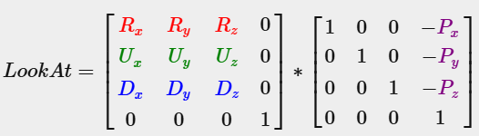

So, the camera is the step were we make operation on the **View Matrix**, OpenGL doesn't have a 'built-in' concept of camera but with the help of the view matrix we can simulate a camera movement by moving ALL objects in the opposite direction, giving the illusion that it is the camera that is moving.

## Camera & View Space

So, when talking about view space, we are talking about all the vertices that are visible from our camera. To define one camera you need to have a position, direction of the 'look at', a vector pointing right and up. Basically, we are creating another coordinate system within our world coordinate system if that makes sense.


### Camera Position

For starter, the position, relatively easy just a simple `vec3` to define a point in world space.

```cpp
auto cameraPos = glm::vec3(0.0f,0.0f,3.0f);
```

>[!note]
> Remember OpenGL is a Right-handed System so the Z axis is going 'toward' our screen.

### Camera Direction

The next thing necessary is the direction to where the camera is looking. To get started we will make the camera look at the world origin so 0,0,0.

```cpp
auto cameraTarget = glm::vec3(0.0f,0.0f,0.0f);
glm::vec3 cameraDirection = glm::normalize(cameraPos - cameraTarget);
```

>[!caution]
> The direction vector is actually pointing in the opposite direction of what we will be looking at.

### The Right Axis

Next is the vector pointing to the right that will represent the positive X axis of the camera coordinate space. With so help of a little trick using **cross product** we can define first a up vector then do a cross product with the direction and obtain a new vector perpendicular to them, that will create our positive Z axis.

>[!note]
>The cross product of 2 vector will result in a new vector perpendicular to the 2 given vector.

```cpp
auto up = glm::vec3(0.0f,1.0f,0.0f);
glm::vec3 cameraRight = glm::normalize(glm::cross(up, cameraDirection));
```

### The Up Axis

Same can be applied to the Up axis, do a cross product on our new right axis and the direction.

```cpp
glm::vec3 cameraUp = glm::cross(cameraDirection, cameraRight);
```

with those newly created vectors we an now create a `lookAt` matrix.

## Look At

So, with our new 3 perpendicular axis and a translation vector we can now create a look at matrix.



Where R is the right vector, U the up vector, D the direction and P the position. Also as the goal of the "camera" is just giving the illusion that we are moving we actually move the whole world. That mean that the Rotation matrix (left) and translation (right) are inverted.

thankfully glm already have some built-in function for that.

```cpp
glm::mat4 view;
view = glm::lookAt(glm::vec3(0.0f,0.0f,3.0f),
				   glm::vec3(0.0f,0.0f,0.0f),
				   glm::vec3(0.0f,1.0f,0.0f));
```

the `glm::lookAt` function takes the position, target and up vector respectively and will then create a view matrix.

## Camera Movements

To move our camera ourselves we need to first define some camera variable:

```cpp
glm::vec3 cameraPos = glm::vec3(0.0f, 0.0f, 3.0f);
glm::vec3 cameraFront = glm::vec3(0.0f, 0.0f, -1.0f);
glm::vec3 cameraUp = glm::vec3(0.0f, 1.0f, 0.0f);
```

and then use those variables to create our view matrix:

```cpp
view = glm::lookAt(cameraPos, cameraPos + cameraFront, cameraUp);
```

for the input we can use the already defined `processInput` function:

```cpp
void processInput(GLFWwindow *window) {
	...
	const float cameraSpeed = 0.05f; // adjust accordingly
	if (glfwGetKey(window, GLFW_KEY_W) == GLFW_PRESS)
		cameraPos += cameraSpeed * cameraFront;
	if (glfwGetKey(window, GLFW_KEY_S) == GLFW_PRESS)
		cameraPos -= cameraSpeed * cameraFront;
	if (glfwGetKey(window, GLFW_KEY_A) == GLFW_PRESS)
		cameraPos -= glm::normalize(glm::cross(cameraFront, cameraUp)) * cameraSpeed;
	if (glfwGetKey(window, GLFW_KEY_D) == GLFW_PRESS)
		cameraPos += glm::normalize(glm::cross(cameraFront, cameraUp)) * cameraSpeed;
}
```

the used of `glm::normalize` here is to ensure consistent movements that do not depend on the cameraFront vector.

## Camera Look Around

Now that we can move the it would be cool if we would be able to also look around with the mouse.
To do that we have to manipulate the direction of the `cameraFront` vector so we can update the direction we are looking at based on mouse movements.

To represents 3D rotations, we use **Euler Angles** composed of: pitch, yaw and roll.


*Pitch* determine how much we look up and down, yaw the left/right rotation and roll can represent how a plane roll on itself for example. The combination of those 3 angles can then calculate any 3D rotation. In my case, roll is will not be used since there will be no case of roll usage in my project.


Yey trigonometry, (*imma kms*)

Let's start with yaw, from a top down view and assuming the yaw angle to be clockwise to the x side:


The length of x side is $cos(yaw)$ and the length of the z side is $sin(yaw)$. Converted to glm we have this:

```cpp
glm::vec3 direction;
direction.x = glm::cos(glm::radians(yaw));
direction.z = glm::sin(glm::radians(yaw));
```

Same logic apply to the pitch:


```cpp
direction.y = glm::sin(glm::radians(pitch))
```

BUT, as we can see from the figure the XZ axis are influenced by the $cos(pitch)$ so we need to take that into account when doing our calculation of the yaw.

```cpp
direction.x = cos(glm::radians(yaw)) * cos(glm::radians(pitch));
direction.y = sin(glm::radians(pitch));
direction.z = sin(glm::radians(yaw)) * cos(glm::radians(pitch));
```

and because of the z axis in reverse direction we can setup the default yaw to -90 so it face "correctly" for us.

We now have the formulas but we actually need to update those pitch and yaw from mouse inputs.

Lets start by telling glfw to capture the mouse:
```rust
glfwSetInputMode(window, GLFW_CURSOR, GLFW_CURSOR_DISABLED);
```

Similar to how we created a callback to process keyboard inputs, we will to the same for mouse inputs.

```cpp
void mouse_callback(GLFWwindow* window, double xpos, double ypos);
```

And tell glfw to use this callback:

```cpp
glfwSetCursorPosCallback(window, mouse_callback);
```

To update our camera direction we need to follow some steps:
- Calculate the mouse movements since the last frame
- Add those movement offset to the camera's yaw and pitch values
- Add some constraints if needed for min/max yaw and pitch
- Calculate the new direction vector

Step 1:

we can store the values of the last X and Y pos of the mouse during the last frame.

```cpp
float lastX = 400, lastY = 300;
```

and when we receive a mouse callback we calculate the offset movements:

```cpp
float xoffset = xpos - lastX;
float yoffset = lastY - ypos; // reversed since y-coord range from bottom to top
lastX = xpos;
lastY = ypos;

const float sensitivity = 0.1f;
xoffset *= sensitivity;
yoffset *= sensitivity;
```

the sensitivity is necessary to avoid extreme movements.

we can then add these offset to the yaw and pitch:

```cpp
yaw += xoffset;
pitch += yoffset;
```

Next the constraints, we want to limit the view to not go higher than 89 degrees and not below -89 to avoid some weird flips:

```cpp
if (pitch > 89.0f)
	pitch = 89.0f;
if (pitch < -89.0f)
	pitch = -89.0f;
```

constraints can also be added to yaw if needed it entirely depend on the camera goal.

now that we have our yaw and pitch we want to update our direction vector.

```cpp
glm::vec3 direction;
direction.x = glm::cos(glm::radians(yaw)) * glm::cos(glm::radians(pitch));
direction.y = glm::sin(glm::radians(pitch));
direction.z = glm::sin(glm::radians(yaw)) * glm::cos(glm::radians(pitch));
cameraFront = glm::normalize(direction);
```

