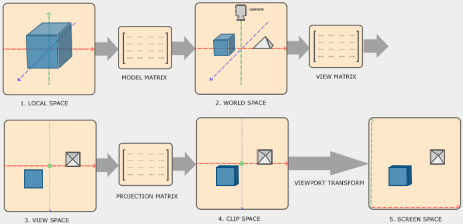

As we seen so far, OpenGL expect all the **visible** vertices coordinates to be between -1.0 and 1.0 everything outside this range will not be visible.

Transforming the coordinate of an object to a **normalized device coordinate (NDC)** is completed via multiples steps. This allow us to split some operation and make certain opeeration easier in certain steps of the processus.

There are 5 total different coordinates systems:

- [Local Space (or Object Space)](#Local Space) [{Obsidian.}](#Local%20Space)
- [World Space](#World Space) [{Obsidian.}](#World%20Space)
- [View Space (or Eye Space)](#View Space) [{Obsidian.}](#View%20Space)
- [Clip Space](#Clip Space) [{Obsidian.}](#Clip%20Space)

## TL;DR

For the coordinates to go from one space to another we will use multiples *transformation matrix*, the most important being:
- model matrix
- view matrix
- projection matrix

Our vertex coord start as *local coord* in the *local space* that will then be process into *world coord*, *view coord*, *clip coord* and finally *screen coord*.




1. The ***Local Coordinates*** are the coordinates you give to your object to begin with.
2. Then converted into ***World Coordinates*** which are coordinates relative to some global world origin together with other object in the world (objects could have the same local coordinates but different world coordinates)
3. The ***View Coordinates*** are the coordinates base on view of the camera POV.
4. The ***Clip Coordinates*** is where we convert "readable" coordinates to the -1.0 to 1.0 range and determine which vertices are visible on the screen.
5. Finally, the ***Screen Coordinates*** are processed via what we call *viewport transform* which convert our -1.0 to 1.0 coord to the actual `glViewport`.

## The "long" run
### Local Space

The ***Local Space*** is the coordinates only relative to an object own environment (sort of). The local coord of an object doesn't mirror the final coord of this object at the end of the coord pipeline.
For instance, any object created with an 3rd party software (e.q Blender) most likely have (0,0,0) as origin but of course in the end it might not necessarily (0,0,0).

### World Space

So if the "issue" of the (0,0,0) coords from above wasn't resolved, we would end up with all object overlaping each other at the world's origin. So, the ***World Space*** coords are what enable us to set coords relative to a (game) world.

This is where the ***Model Matrix*** comes in clutch.

#### Model Matrix

The ***Model Matrix*** is transformation matrix that apply, translation, scaling and rotation relative to a greater world space so it fit with other objects in the scene/world.

### View Space

The ***View Space*** is where the coordinates are converted relatively to us (the viewer of the scene), in other word, the camera. This is where we define the space "visible" by a camera.

#### View Matrix
later

### Clip Space

The ***Clip Space*** is where we convert our "readable" coordinates to coordinates as OpenGL expect them between the -1.0 to 1.0 range. This is where the ***Projection Matrix*** comes in clutch.

The viewport created by the projection matrix is name frustum, what's fitting inside this frustum will end up in the user screen.

The last step is what we call the *Perspective division*. This is where the 4th element of vec4 is used to create depth. This step is performed automatically at the end of the vertex shader.

We can create 2 different ***Projection Matrix***, the orthographic projection matrix or the perspective projection matrix.

#### Orthographic projection

An orthographic projection matrix define a cube/rectangle like frustum box. To create an orthographic projection matrix we need to specify the width, height and **length** of the frustum box.


The frustum defines the visible area, specified by a width, height, and a far and near plane. Anything in front of the near plane is clipped, behind the far plane is clipped and outside of the width and height size is clipped.

glm have an built-in object for building an orthographic projection matrix `glm::ortho`

```cpp
glm::ortho(0.0f, 800.0f, 0.0f, 600.0f, 0.1f, 100.0f);
```

`glm::ortho(left, right, bottom, top, near, far)`

**left** : the left coord of the frustum.
**right** : the right coord of the frustum.
**bottom** : the bot coord of the frustum.
**top** : the top coord of the frustum.
**near** : the distance of the near plane.
**far** : the distance of the far plane.

The orthographic projection maps coordinates as a 2D plane on the screen since it doesn't take the perspective into account (this is the work of the ***Perspective projection matrix***).

#### Perspective projection

For a more "realistic" projection we want to display farther objects smaller, this is perspective.


As stated before, the farther the object, the smaller it get. This is what the perspective projection matrix try to reproduce. This is where the *w* element is used, the further the object the higher the *w* element become. Once in clip space the coordinates are in range -w to w, Then the perspective division is applied:                      
                          | x/w |
                          | y/w |
                          | z/w |

Each component of the vertex is divided by its w element giving smaller vertex coordinates the further away a vertex is from the viewer/camera.

Using glm a perspective projection matrix can be created like so:

```cpp
glm::mat4 proj = glm::perspective(glm::radians(45.0f), (float)width/(float)height, 0.1f, 100.0f);
```

similar to `glm::ortho`, `glm::perspective` is used to create a projection matrix, but this time a perspective projection matrix.


`glm::perspective(FOV, aspectRatio, near, far)`

