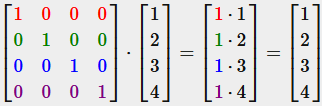
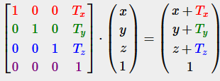
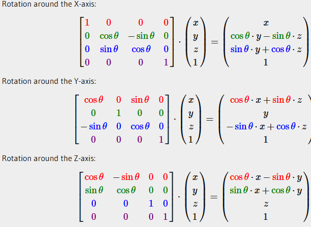

Matrices are mainly use to transform vectors from one space to another.

## Matrix & Matrix Multiplication


>[!warning]
>You can only multiply two matrices if the **number of columns on the left-hand side** matrix is equal to the **number of rows on the right-hand side matrix**.

>[!warning]
>Order in matrices operation matter !
>A ⋅ B ≠ B ⋅ A

## Matrix & Vector Multiplication

### Identity Matrix

An identity matrix is an NxN matrix filled with 0s except in its diagonals.



Operations with an identity matrix leave the vector as is.

### Scaling


### Translation



### Rotation



## GLM

Thankfully the glm (Open**GL** **M**athematics) library handle those operation.

```cpp
auto mat = glm::mat4(1.0f); // this generate an identity matrix

glm::vec4 vec(1.0f,0.0f,0.0f,1.0f); // a vector 4

// translate operation (on the above vector)
mat = glm::translate(mat, glm::vec3(1.0f,1.0f,0.0f));
vec = mat * vec

// rotate operation
mat = glm::rotate(mat, glm::radians(90.0f), glm::vec3(0.0f,0.0f,0.0f));

// scale operation
mat = glm::scale(mat, glm::vec3(0.5f,0.5f,0.5f));
```